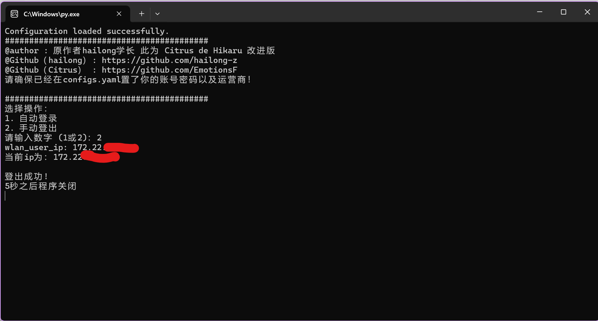
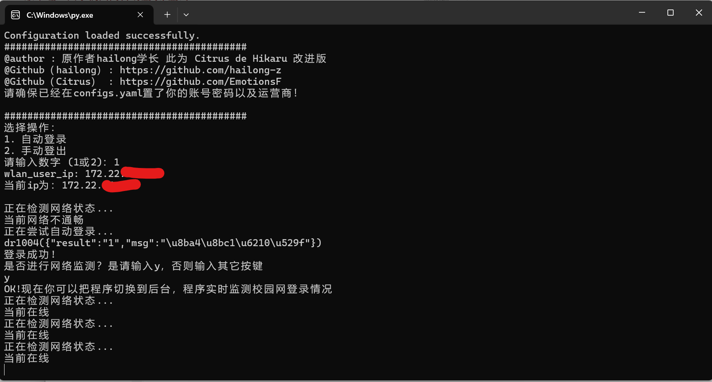

## 东华理工大学校园网自动登录/登出
>-*- coding:utf-8 -*- 
> @author : washiobi3109@gmail.com 
> @Github : https://github.com/EmotionsF  
> @Time : 2024/11/29 19:00   

#### 简介

这是一个继承自学长的github项目

由于学校晚上会对长时间连接校园网的用户进行QoS限速，需要重新登录校园网重置登录时长，再加上我对路由器有刚需，由于进行了两次NAT转换导致学长登录校园网的脚本失效，晚上又因为校园网巨卡无比气到吐血，故自行升级了这个脚本。

这个脚本在原本学长的基础上，增加了校园网登出功能，并通过从登录界面获取当前设备ip的方法适配了路由器登录校园网。本程序不需要python运行环境，只需配置好 `configs.yaml` 即可直接用来登录校园网，理论上适用于Windows和Linux系统的电脑和各种路由器

#### 使用方法

1. 将压缩包解压放置在非中文目录中，在configs.yaml中配置好自己的账号密码和运营商

2. 将路由器或者电脑连接到校园网，路由器需要和一台电脑建立连接

3. 运行 `main.exe` ，即可自动登录或者登出校园网

希望这一程序能够方便咱们学校的路由器用户，并且给其它的学校作为参考

